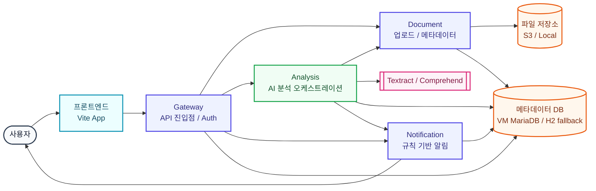
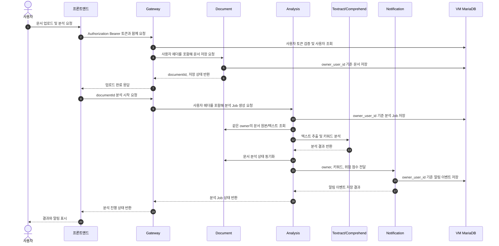

# SmartDoc AI

SmartDoc AI는 비정형 문서를 AI로 분석하고 후속 업무를 자동화하며, SaaS 형태의 서비스 제공과 PaaS 형태의 확장 가능한 운영 환경을 지향하는 플랫폼입니다.

## Docs Index
- PRD: [PRD 요약](#prd-요약)
- Architecture: [Architecture](#architecture)
- ERD: [ERD](#erd)
- API: [`docs/api.md`](./docs/api.md)
- UI: [UI](#ui)

## 전체 흐름


## 문서 분석 시퀀스


## PRD 요약
### 프로젝트 개요
- 프로젝트명: SmartDoc AI
- 목표: 비정형 문서를 AI로 분석해 구조화 데이터로 전환하고, 규칙 기반 알림으로 후속 업무를 자동화

### 핵심 시나리오
1. 문서 업로드 및 S3 저장
2. Textract로 텍스트/테이블 추출
3. Comprehend로 키워드/감성 분석
4. 메타데이터 저장/조회
5. 키워드 조건 충족 시 알림 발송

### 기술 스택 방향
- Backend: Spring Boot 3.x, Kotlin, Java 17
- Frontend: React, Vite
- Infra: EKS(Kubernetes), ALB, CloudWatch
- Storage: S3 + RDBMS(MSSQL 가정)
- Security: JWT/2FA(계획)

### 구현 단계(현재 기준)
1. 로컬 기능 단계: API/도메인/JPA(H2) 검증
2. 인프라 단계: Kubernetes base 확장(Probe/HPA/Ingress/Secret)
3. AWS 연동 단계: S3/Textract/Comprehend + MSSQL + EKS 배포

## Architecture
### 핵심 컴포넌트
- 프론트엔드: 루트 앱(`src`, `vite`)
- Gateway: API 진입점/라우팅/Auth v1
- Document: 문서 수명주기/메타데이터
- Analysis: Textract/Comprehend 오케스트레이션
- Notification: 알림 디스패치
- 저장소: S3(원본), RDBMS(메타데이터)

### 배포 가정
- Amazon EKS + ALB
- CloudWatch 로그 수집
- 로컬 검증: Docker Compose + kind/Kubernetes `infra/k8s/base`

### 데이터 흐름
1. 프론트엔드가 Gateway Auth API로 로그인하고 JWT access token을 저장
2. 프론트엔드가 Gateway로 API 요청할 때 `Authorization: Bearer <token>`을 전달
3. Gateway가 토큰을 검증한 뒤 `X-SmartDoc-User-Id`, `X-SmartDoc-User-Email` 헤더를 downstream 서비스에 전달
4. Document가 `owner_user_id` 기준으로 원본 파일/문서 메타데이터를 저장하고 조회
5. Analysis가 `owner_user_id` 기준으로 분석 Job을 생성하고 document 상태를 동기화
6. Analysis가 같은 owner의 document 로컬 텍스트 내용을 조회해 키워드 감지 결과를 저장
7. Analysis가 notification으로 owner/키워드/위험 점수를 전달
8. Notification이 같은 owner의 enabled rule과 키워드를 매칭해 알림 이벤트 저장

### 현재 단계와 연동 계획
- 현재: 로컬 개발 단계(H2 또는 VM MariaDB/JPA, Gateway Auth v1, 로컬 파일 업로드, 실제 Docker 이미지, Kubernetes base 매니페스트)
- Gateway Auth v1은 별도 인증 서비스를 띄우지 않고 Gateway DB에 `app_users`를 저장합니다.
- 로컬 기본 계정은 `test@smartdoc.local` / `password`이며, 재시작 시 seed로 자동 생성됩니다.
- document/analysis/notification 데이터는 `owner_user_id`로 분리됩니다.
- Gateway를 거치지 않고 서비스를 직접 호출하면 로컬 개발 기본 owner인 `local-dev-user`가 사용됩니다.
- 기본 프로필은 H2 in-memory이며, `SPRING_PROFILES_ACTIVE=mariadb`로 VM MariaDB를 사용할 수 있습니다.
- 로컬 컨테이너 검증:
  - Docker Compose: `infra/docker/docker-compose.yml`
  - Kubernetes: `smartdoc/*:local` 이미지를 kind/minikube에 로드 후 `infra/k8s/base` 적용
- 다음: AWS/EKS 연동
  - 필요 시 후반부에 RDBMS를 AWS RDS 등으로 전환
  - S3/Textract/Comprehend 연동 어댑터 추가
  - EKS 배포(Deployment/Service + Ingress/Secret/ConfigMap)로 운영 경로 전환

## 가장 먼저 할 일
로컬 기준선부터 맞춥니다.

1. `docker --version`
2. `kubectl version --client`
3. `kind version` 또는 `minikube version`
4. `java -version` (Java 17)
5. `node -v` (Node 20+)

## 빠른 실행
### 프론트엔드
1. `npm install`
2. `.env.example` 참고 후 `.env.local` 작성
3. `npm run dev`

로컬 API 프록시:
- `/api/gateway/*` -> `http://localhost:8080/api/v1/*` (프론트 기본 진입점)
- `/api/document/*` -> `http://localhost:8081/api/v1/*`
- `/api/analysis/*` -> `http://localhost:8082/api/v1/*`
- `/api/notification/*` -> `http://localhost:8083/api/v1/*`

### 백엔드 (서비스별)
메모리 부담을 줄이려면 필요한 서비스만 따로 켭니다.

1. `scripts/run-service.sh document`
2. `scripts/run-service.sh analysis`
3. `scripts/run-service.sh notification`
4. `scripts/run-service.sh gateway`

한 번에 켜야 할 때:

```bash
scripts/run-backend-local.sh
```

로컬 백엔드 실행 후 smoke 점검:

```bash
scripts/smoke-local.sh
scripts/smoke-gateway.sh
```

로컬 개발용 로그인:
- Gateway가 개발용 Auth v1을 담당합니다.
- 기본 계정: `test@smartdoc.local` / `password`
- 사용자 DB는 Gateway H2 in-memory라 재시작 시 초기화되지만, 기본 계정은 자동으로 다시 생성됩니다.

### 백엔드 + VM MariaDB
H2 대신 VM MariaDB를 사용할 때는 `.env.example`을 참고해 `.env.local`에 DB 접속값을 둡니다.

```bash
SPRING_PROFILES_ACTIVE=mariadb
SMARTDOC_DB_HOST=<VM_IP>
SMARTDOC_DB_PORT=3306
SMARTDOC_DB_USERNAME=smartdoc
SMARTDOC_DB_PASSWORD=<비밀번호>
```

기본 DB 이름:
- gateway: `smartdoc_gateway`
- document: `smartdoc_document`
- analysis: `smartdoc_analysis`
- notification: `smartdoc_notification`

서비스 실행은 기존과 동일합니다.

```bash
scripts/run-service.sh document
scripts/run-service.sh analysis
scripts/run-service.sh notification
scripts/run-service.sh gateway
```

MariaDB 연결 후 smoke 점검:

```bash
scripts/smoke-gateway.sh
```

주의:
- `.env.local`에는 DB 비밀번호가 들어가므로 git에 올리지 않습니다.
- H2 로컬 모드로 돌아가려면 `SPRING_PROFILES_ACTIVE=local`로 바꾸면 됩니다.

직접 실행할 때:

1. `cd backend/services/gateway` (또는 `document`, `analysis`, `notification`)
2. `cp .env.example .env`
3. `./gradlew bootRun`

기본 포트:
- gateway `8080`
- document `8081`
- analysis `8082`
- notification `8083`

로컬 파일 업로드:
- 기본 저장 위치: `.smartdoc/uploads`
- 변경 환경변수: `SMARTDOC_LOCAL_UPLOAD_DIR`
- `.smartdoc/`는 git에 올리지 않습니다.

### 인프라 템플릿
Docker Compose로 실제 백엔드 앱 컨테이너 실행:

```bash
docker compose -f infra/docker/docker-compose.yml up --build
```

Compose 실행 후 smoke 점검:

```bash
scripts/smoke-local.sh
```

kind/minikube 기준 Kubernetes 실행:

```bash
scripts/build-images.sh
scripts/load-k8s-images.sh
scripts/deploy-k8s-local.sh
scripts/smoke-k8s.sh
```

메모리 부담이 있으면 이미지만 서비스별로 나눠 빌드할 수 있습니다.

```bash
scripts/build-images.sh document
scripts/build-images.sh analysis
scripts/build-images.sh notification
```

## 백엔드 요약
- 공통 패턴: Spring Boot + Kotlin + Java 17
- 서비스 책임:
  - gateway: API 진입점/라우팅/Auth v1
  - document: 문서 업로드/메타데이터
  - analysis: Textract/Comprehend 오케스트레이션
  - notification: 규칙 기반 알림 디스패치
- 환경변수 접두사:
  - `SMARTDOC_GATEWAY_*`
  - `SMARTDOC_DOCUMENT_*`
  - `SMARTDOC_ANALYSIS_*`
  - `SMARTDOC_NOTIFICATION_*`

### 백엔드 Troubleshooting
- `fileHashes.lock (Permission denied)`:
  - `sudo chown -R $USER:$USER backend/services/<service>`
  - `rm -rf backend/services/<service>/.gradle`
  - `cd backend/services/<service> && ./gradlew bootRun`
- 환경 제약 우회 실행:
  - `GRADLE_USER_HOME=/tmp/.gradle ./gradlew --no-daemon --project-cache-dir /tmp/<service>-projcache bootRun`

### 백엔드 테스트
메모리 부담을 줄이려면 서비스별로 따로 실행합니다.

```bash
cd backend/services/document && ./gradlew test
cd backend/services/analysis && ./gradlew test
cd backend/services/notification && ./gradlew test
```

## 인프라 요약
### Docker Compose
- 목적: 로컬 통합 실행 기준점
- 현재: H2 기반 실제 앱 이미지 빌드/실행
- DB 방침: 기본은 H2 in-memory, 필요 시 `mariadb` 프로필로 VM MariaDB 사용
- 다음 단계: 시크릿 분리, AWS 연동 후반부에 운영 DB 전환 여부 재검토

### Kubernetes Base
- 경로: `infra/k8s/base`
- 포함: `namespace`, `*-deployment`, `*-service`
- 현재 검증:
  - `kubectl apply --dry-run=client --validate=false -f infra/k8s/base`
- 로컬 Kubernetes 이미지: `smartdoc/*:local` (`kind` 또는 `minikube`에 로드)
- 다음 단계: HPA, Ingress 컨트롤러 실제 연동, 운영 이미지 레지스트리 전환

## ERD
### 애그리게잇 후보
- AppUser
- Document
- AnalysisJob
- AlertRule
- AlertEvent

### 물리 스키마 초안 (기본 H2, 선택 VM MariaDB)
- `app_users(user_id, email, password_hash, display_name, role, created_at)`
- `documents(id, owner_user_id, file_key, filename, status, content_type, created_at, updated_at)`
- `analysis_jobs(id, owner_user_id, document_id, state, analysis_provider, result_summary, risk_score, keywords, notification_dispatched_at, created_at)`
- `keyword_detections(id, analysis_job_id, keyword, confidence, created_at)`
- `notification_rules(id, owner_user_id, keyword, channel, enabled, created_at)`
- `notification_events(id, owner_user_id, document_id, channel, message, status, created_at)`

### 현재 구현 상태
- `gateway`: JPA로 개발용 `app_users` 저장, 기본 seed 계정 자동 생성
- `document`: JPA로 `owner_user_id` 기준 `documents` 저장/조회
- `analysis`: JPA로 `owner_user_id` 기준 `analysis_jobs`, `keyword_detections` 저장/조회
- `notification`: JPA로 `owner_user_id` 기준 `notification_events`, `notification_rules` 저장/조회
- 기본 실행은 H2 in-memory이며, `mariadb` 프로필에서는 VM MariaDB의 서비스별 DB를 사용
- Gateway가 `X-SmartDoc-User-Id` 헤더를 downstream 서비스에 전달하고, 헤더가 없으면 로컬 기본값 `local-dev-user`를 사용
- `analysis` 완료 시 키워드 감지 결과를 저장하고, enabled `notification_rules` 매칭 결과로 `notification_events`를 자동 생성
- `analysis_jobs.notification_dispatched_at`으로 같은 Job의 자동 알림 판단 중복을 방지

### 인덱스 아이디어
- `app_users(email)` unique
- `documents(owner_user_id, status, created_at)`
- `analysis_jobs(owner_user_id, document_id)`
- `notification_events(owner_user_id, document_id, created_at)`
- `keyword_detections(keyword)`
- `keyword_detections(analysis_job_id, keyword)` unique
- `notification_rules(owner_user_id, keyword, channel)` unique

## 프론트엔드 구조
프론트엔드는 요청하신 대로 루트로 평탄화했습니다.
실행 파일(`package.json`, `src`, `vite.config.ts`, `index.html`)은 루트에서 직접 동작합니다.

## UI
### 화면 인벤토리
- 로그인/회원가입
- 메인 대시보드
- 문서 목록/검색/필터
- 문서 상세: 분석 실행, 분석 Job 상태, 분석 요약/리스크/키워드, 알림 발송, 알림 이벤트 목록
- 업로드 모달/페이지
- 알림 규칙 관리: 키워드/채널/활성 여부 등록 및 갱신
- 알림 이력

### 현재 구현 상태
- 로그인/회원가입 화면에서 Gateway Auth v1(`POST /api/v1/auth/login`, `POST /api/v1/auth/signup`) 사용
- 로그인 성공 후 JWT access token을 브라우저 `localStorage`에 저장하고 Gateway 요청에 자동 첨부
- 로그아웃 시 서버는 stateless 처리하고 프론트에서 저장된 token을 삭제
- 문서 목록에서 파일 선택 또는 메타데이터 입력으로 새 문서 등록 후 상세 화면으로 이동
- 파일 선택 시 `POST /api/v1/documents/upload`로 로컬 업로드 API 호출
- 알림 규칙 화면에서 `GET /api/v1/notifications/rules`, `POST /api/v1/notifications/rules`로 규칙 관리
- 상세 화면에서 `POST /api/v1/analysis/jobs`로 분석 실행
- 상세 화면에서 text/plain 파일 내용 기반 `resultSummary`, `riskScore`, `keywords` 표시
- 분석 완료 후 enabled 알림 규칙과 키워드가 매칭되면 Slack 알림 이벤트 자동 생성
- 상세 화면에서 `POST /api/v1/notifications/dispatch`로 Slack 알림 이벤트 수동 생성도 가능
- 상세 화면에서 `GET /api/v1/notifications/events` 결과 중 현재 문서 이벤트 표시

### 로컬 인증 UX
- 기본 로그인 계정: `test@smartdoc.local` / `password`
- H2 in-memory라 재시작 시 가입 사용자는 초기화되지만, 기본 계정은 자동으로 다시 생성
- 운영 인증 방식은 AWS/운영 배포 단계에서 별도 검토

### 캡처 로그 템플릿
| 날짜 | 화면 | 목적 | 파일 |
|------|------|------|------|
| YYYY-MM-DD | 대시보드 | AG Grid 개요 | docs/evidence/dashboard.png |

## 저장소 구조
```text
SmartDoc_AI/
├── README.md
├── package.json                # 프론트엔드 실행 단위(루트)
├── src/
├── backend/                    # 백엔드 서비스 코드
├── infra/                      # Docker/K8s 매니페스트
└── docs/                       # 역할별 문서(.md)
```
