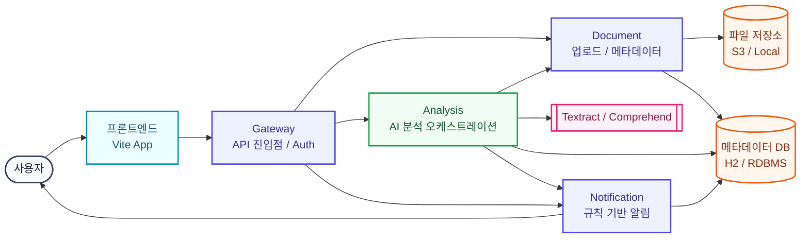
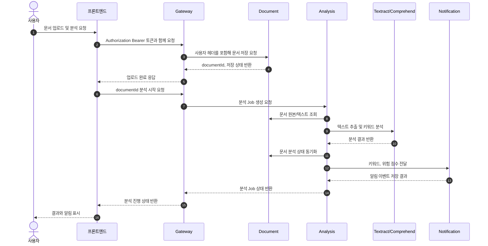

# SmartDoc AI

SmartDoc AI는 비정형 문서를 AI로 분석하고 후속 업무를 자동화하며, SaaS 형태의 서비스 제공과 PaaS 형태의 확장 가능한 운영 환경을 지향하는 플랫폼입니다.

## 전체 흐름


## 문서 분석 시퀀스


## 가장 먼저 할 일
로컬 기준선부터 맞춥니다.

1. `docker --version`
2. `kubectl version --client`
3. `kind version` 또는 `minikube version`
4. `java -version` (Java 17)
5. `node -v` (Node 20+)

## 빠른 실행
### 프론트엔드
1. `npm install`
2. `.env.example` 참고 후 `.env.local` 작성
3. `npm run dev`

로컬 API 프록시:
- `/api/gateway/*` -> `http://localhost:8080/api/v1/*` (프론트 기본 진입점)
- `/api/document/*` -> `http://localhost:8081/api/v1/*`
- `/api/analysis/*` -> `http://localhost:8082/api/v1/*`
- `/api/notification/*` -> `http://localhost:8083/api/v1/*`

### 백엔드 (서비스별)
메모리 부담을 줄이려면 필요한 서비스만 따로 켭니다.

1. `scripts/run-service.sh document`
2. `scripts/run-service.sh analysis`
3. `scripts/run-service.sh notification`
4. `scripts/run-service.sh gateway`

한 번에 켜야 할 때:

```bash
scripts/run-backend-local.sh
```

로컬 백엔드 실행 후 smoke 점검:

```bash
scripts/smoke-local.sh
scripts/smoke-gateway.sh
```

로컬 개발용 로그인:
- Gateway가 개발용 Auth v1을 담당합니다.
- 기본 계정: `test@smartdoc.local` / `password`
- 사용자 DB는 Gateway H2 in-memory라 재시작 시 초기화되지만, 기본 계정은 자동으로 다시 생성됩니다.

직접 실행할 때:

1. `cd backend/services/gateway` (또는 `document`, `analysis`, `notification`)
2. `cp .env.example .env`
3. `./gradlew bootRun`

기본 포트:
- gateway `8080`
- document `8081`
- analysis `8082`
- notification `8083`

로컬 파일 업로드:
- 기본 저장 위치: `.smartdoc/uploads`
- 변경 환경변수: `SMARTDOC_LOCAL_UPLOAD_DIR`
- `.smartdoc/`는 git에 올리지 않습니다.

### 인프라 템플릿
Docker Compose로 실제 백엔드 앱 컨테이너 실행:

```bash
docker compose -f infra/docker/docker-compose.yml up --build
```

Compose 실행 후 smoke 점검:

```bash
scripts/smoke-local.sh
```

kind/minikube 기준 Kubernetes 실행:

```bash
scripts/build-images.sh
scripts/load-k8s-images.sh
scripts/deploy-k8s-local.sh
scripts/smoke-k8s.sh
```

메모리 부담이 있으면 이미지만 서비스별로 나눠 빌드할 수 있습니다.

```bash
scripts/build-images.sh document
scripts/build-images.sh analysis
scripts/build-images.sh notification
```

## 백엔드 요약
- 공통 패턴: Spring Boot + Kotlin + Java 17
- 서비스 책임:
  - gateway: API 진입점/라우팅/Auth v1
  - document: 문서 업로드/메타데이터
  - analysis: Textract/Comprehend 오케스트레이션
  - notification: 규칙 기반 알림 디스패치
- 환경변수 접두사:
  - `SMARTDOC_GATEWAY_*`
  - `SMARTDOC_DOCUMENT_*`
  - `SMARTDOC_ANALYSIS_*`
  - `SMARTDOC_NOTIFICATION_*`

### 백엔드 Troubleshooting
- `fileHashes.lock (Permission denied)`:
  - `sudo chown -R $USER:$USER backend/services/<service>`
  - `rm -rf backend/services/<service>/.gradle`
  - `cd backend/services/<service> && ./gradlew bootRun`
- 환경 제약 우회 실행:
  - `GRADLE_USER_HOME=/tmp/.gradle ./gradlew --no-daemon --project-cache-dir /tmp/<service>-projcache bootRun`

### 백엔드 테스트
메모리 부담을 줄이려면 서비스별로 따로 실행합니다.

```bash
cd backend/services/document && ./gradlew test
cd backend/services/analysis && ./gradlew test
cd backend/services/notification && ./gradlew test
```

## 인프라 요약
### Docker Compose
- 목적: 로컬 통합 실행 기준점
- 현재: H2 기반 실제 앱 이미지 빌드/실행
- DB 방침: 당분간 H2 in-memory 유지
- 다음 단계: 시크릿 분리, AWS 연동 후반부에 운영 DB 전환 여부 재검토

### Kubernetes Base
- 경로: `infra/k8s/base`
- 포함: `namespace`, `*-deployment`, `*-service`
- 현재 검증:
  - `kubectl apply --dry-run=client --validate=false -f infra/k8s/base`
- 로컬 Kubernetes 이미지: `smartdoc/*:local` (`kind` 또는 `minikube`에 로드)
- 다음 단계: HPA, Ingress 컨트롤러 실제 연동, 운영 이미지 레지스트리 전환

## 문서
- 인덱스: [`docs/docs.md`](./docs/docs.md)
- PRD: [`docs/prd.md`](./docs/prd.md)
- Architecture: [`docs/architecture.md`](./docs/architecture.md)
- ERD: [`docs/erd.md`](./docs/erd.md)
- API: [`docs/api.md`](./docs/api.md)
- UI: [`docs/ui.md`](./docs/ui.md)

## 프론트엔드 구조
프론트엔드는 요청하신 대로 루트로 평탄화했습니다.
실행 파일(`package.json`, `src`, `vite.config.ts`, `index.html`)은 루트에서 직접 동작합니다.

## 저장소 구조
```text
SmartDoc_AI/
├── README.md
├── package.json                # 프론트엔드 실행 단위(루트)
├── src/
├── backend/                    # 백엔드 서비스 코드
├── infra/                      # Docker/K8s 매니페스트
└── docs/                       # 역할별 문서(.md)
```
