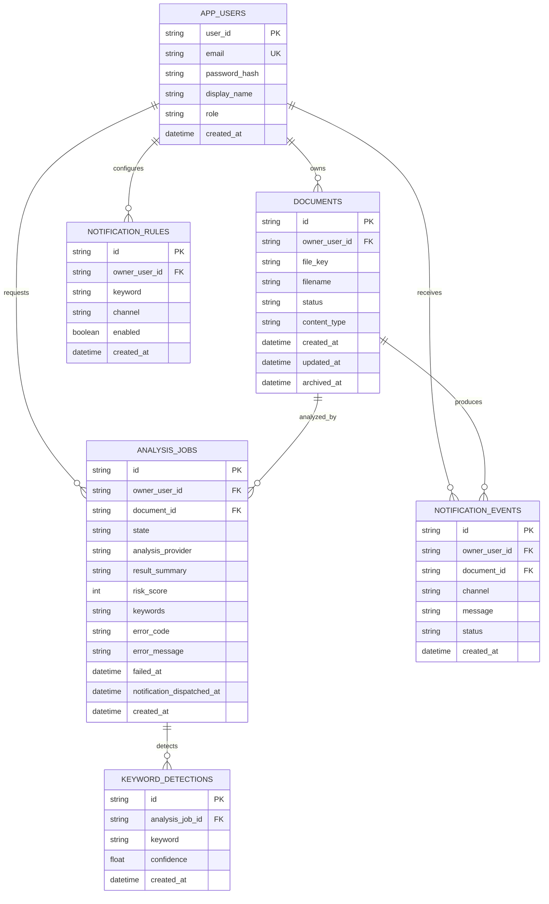

# ERD

## 애그리게잇 후보
- AppUser
- Document
- AnalysisJob
- AlertRule
- AlertEvent

## ERD 다이어그램

## 물리 스키마 초안 (기본 H2, 선택 VM MariaDB)
- `app_users(user_id, email, password_hash, display_name, role, created_at)`
- `documents(id, owner_user_id, file_key, filename, status, content_type, created_at, updated_at, archived_at)`
- `analysis_jobs(id, owner_user_id, document_id, state, analysis_provider, result_summary, risk_score, keywords, error_code, error_message, failed_at, notification_dispatched_at, created_at)`
- `keyword_detections(id, analysis_job_id, keyword, confidence, created_at)`
- `notification_rules(id, owner_user_id, keyword, channel, enabled, created_at)`
- `notification_events(id, owner_user_id, document_id, channel, message, status, created_at)`

## 현재 구현 상태
- `gateway`: JPA로 개발용 `app_users` 저장, 기본 seed 계정 자동 생성
- `document`: JPA로 `owner_user_id` 기준 `documents` 저장/조회
- `analysis`: JPA로 `owner_user_id` 기준 `analysis_jobs`, `keyword_detections` 저장/조회
- `notification`: JPA로 `owner_user_id` 기준 `notification_events`, `notification_rules` 저장/조회
- 기본 실행은 H2 in-memory이며, `mariadb` 프로필에서는 VM MariaDB의 서비스별 DB를 사용
- Gateway가 `X-SmartDoc-User-Id` 헤더를 downstream 서비스에 전달하고, 헤더가 없으면 로컬 기본값 `local-dev-user`를 사용
- 문서 삭제는 hard delete 대신 `documents.status=ARCHIVED`, `archived_at` 기록으로 보관 처리
- `analysis` 완료 시 키워드 감지 결과를 저장하고, enabled `notification_rules` 매칭 결과로 `notification_events`를 자동 생성
- `analysis` 실패 시 `analysis_jobs.state=FAILED`, `error_code`, `error_message`, `failed_at`을 저장하고 document 상태를 `ANALYSIS_FAILED`로 동기화
- 실패한 Job은 재시도 API로 같은 `id`를 유지한 채 `QUEUED`로 초기화할 수 있음
- `analysis_jobs.notification_dispatched_at`으로 같은 Job의 자동 알림 판단 중복을 방지

## 인덱스 아이디어
- `app_users(email)` unique
- `documents(owner_user_id, status, created_at)`
- `analysis_jobs(owner_user_id, document_id)`
- `notification_events(owner_user_id, document_id, created_at)`
- `keyword_detections(keyword)`
- `keyword_detections(analysis_job_id, keyword)` unique
- `notification_rules(owner_user_id, keyword, channel)` unique
